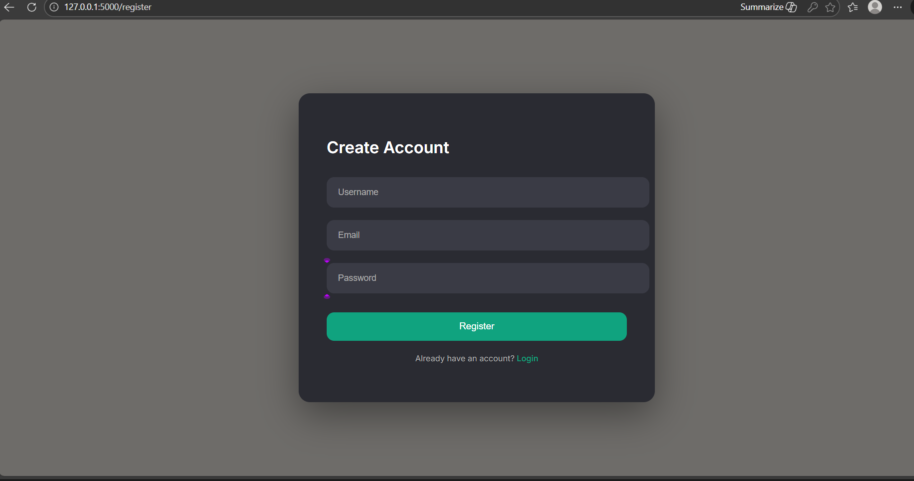
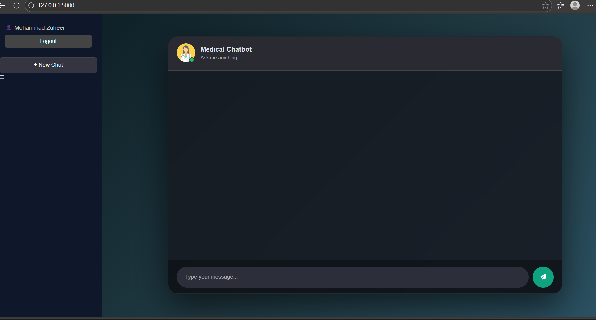
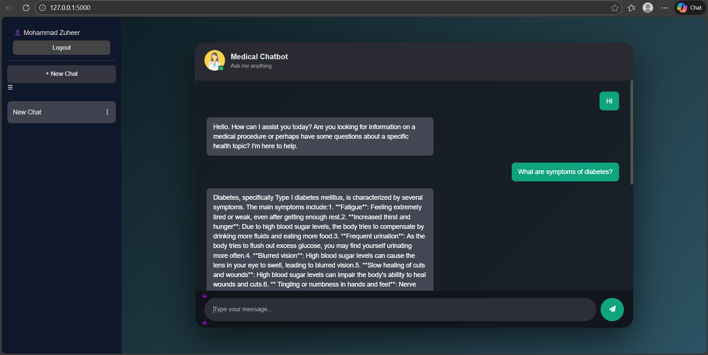

# 🩺 AI-Powered Medical Assistant  
### Full-Stack Web Application with Cloud Vector Search & LLM Integration

This project is a modular full-stack web application that integrates a responsive frontend, RESTful backend, cloud-hosted vector database (Pinecone), and an external LLM (Grok via OpenAI-compatible API).

The system demonstrates backend engineering, API orchestration, cloud integration, semantic retrieval, and production-oriented project structure.

---

## 🚀 Tech Stack

###  Frontend
- HTML5
- CSS3
- Vanilla JavaScript
- Jinja Templates (Server-side rendering)

### Backend
- Flask (Python)
- Flask Blueprints (Modular route structure)
- RESTful route handling (auth & chat endpoints)
- Request/Response lifecycle management
- Environment-based configuration (.env)
- PostgreSQL (Relational Database)
- SQL-based data modeling (User / Chat / Message tables)

### AI & Retrieval Layer
- Hugging Face Sentence Transformers  
  - Embedding dimension: **384**
- Pinecone (Cloud Vector Database)
- Grok LLM (OpenAI-compatible API integration)

### 🔧 Tools & Practices
- Git & GitHub
- Virtual Environment
- requirements.txt dependency management
- .env configuration for secure API keys
- Modular folder architecture 

---
## 🗄️ Database Design

The application uses **PostgreSQL** as the relational database for persistent storage.

### Tables Implemented:

- **users** → Stores registered user credentials
- **chat** → Stores chat sessions associated with users
- **message** → Stores individual messages within each chat

### Relationships:

- One User → Many Chats  
- One Chat → Many Messages  

This relational structure enables conversation history persistence and user-based session management.

User (Browser)
⬇
HTML Templates + JavaScript
⬇
Flask Backend (Blueprint Routes)
⬇
PostgreSQL
   ├── Users Table (Authentication)
   ├── Chat Table (Chat Sessions)
   └── Message Table (Conversation History)
⬇
Embedding Generation (Hugging Face – 384-dim)
⬇
Pinecone Vector Search
⬇
Context Injection
⬇
Grok LLM (OpenAI-Compatible API)
⬇
Response Saved to PostgreSQL
⬇
Rendered Back to UI

---

##  Features

- 🔐 User authentication (Login & Register)
- 💬 Interactive medical chatbot interface
- 🔎 Semantic search using 384-dimensional embeddings
- ☁️ Cloud-hosted vector database (Pinecone)
- 🤖 External LLM integration (Grok API)
- 🔄 LLM integration via OpenAI-compatible client abstraction
- ⚡ RESTful backend request lifecycle
- 🔑 Secure API key management via environment variables
- 🧩 Clean modular architecture (routes / models / core logic separation)
- 🗂️ Persistent conversation history using PostgreSQL
- 👥 User-based chat session management

  

---

## 📂 Project Structure

```
project-root/
│
├── app.py                 # Application entry point
├── config.py              # Configuration settings
├── init_db.py             # Database initialization
├── store_index.py         # Pinecone index setup
├── test.py                # Testing scripts
├── template.sh            # Deployment helper script
├── runtime.txt            # Runtime configuration (for deployment)
├── requirements.txt       # Project dependencies
├── setup.py               # Project setup file
├── info.txt               # Additional project info
├── .gitignore
├── README.md
├── .env                   # Environment variables (NOT pushed to GitHub)
│
├── data/
│   └── medical_book.pdf   # Source knowledge base
│
├── models/                # Data models
│   ├── __init__.py
│   ├── user.py
│   ├── chat.py
│   └── message.py
│
├── routes/                # API route handlers
│   ├── __init__.py
│   ├── auth_routes.py
│   └── chat_routes.py
│
├── src/                   # Core AI & helper logic
│   ├── __init__.py
│   ├── helpers.py
│   └── prompt.py
│
├── static/                # Frontend static assets
│   ├── chat.js
│   └── style.css
│
└── templates/             # HTML templates
    ├── login.html
    ├── register.html
    └── chat.html
```

> Note: The `.env` file is excluded from version control for security reasons and contains API keys for Pinecone, Hugging Face, and Grok.

---

## ⚙️ Installation & Setup

### 1️⃣ Clone Repository

```bash
git clone https://github.com/your-username/your-repo-name.git
cd your-repo-name
```

### 2️⃣ Create Virtual Environment

```bash
python -m venv venv
venv\Scripts\activate
```

### 3️⃣ Install Dependencies

```bash
pip install -r requirements.txt
```

### 4️⃣ Configure Environment Variables

Create a `.env` file:

```
PINECONE_API_KEY=your_key
HUGGINGFACE_API_KEY=your_key
GROK_API_KEY=your_key
DATABASE_URL=your_postgress_link
```

### 5️⃣ Run the Application

```bash
python app.py
```

Application runs at:

```
http://127.0.0.1:5000/
```

---
> Below are screenshots demonstrating authentication, chat functionality, RAG pipeline execution.
## 📸 Screenshots

### 🔐 Authentication




---

### 🖥️ Dashboard / Chat Interface



---

### 💬 Chat in Action (RAG Working)



---


## 🔄 Full-Stack Request Lifecycle

1. User submits medical query from frontend.
2. Flask backend receives POST request via route handler.
3. Query is converted into a 384-dimensional embedding.
4. Pinecone retrieves semantically relevant documents.
5. Retrieved context is injected into the LLM prompt.
6. Grok LLM generates contextual response.
7. Backend formats response.
8. Frontend dynamically renders answer.

---

## ⚙️ API Integration Design

The LLM layer is implemented using an OpenAI-compatible client interface,  
allowing flexible switching between LLM providers without modifying core backend logic.

This abstraction improves maintainability and extensibility.

---

## Concepts Demonstrated

- Separation of concerns (UI / Routes / Models / Core Logic)
- RESTful backend architecture
- Cloud vector database integration
- External API orchestration
- Environment-based configuration
- Modular scalable design
- Secure credential management
- Debugging streaming responses
- Structured deployment configuration
- Relational database modeling (User / Chat / Message relationships)

---

## 📈 Future Improvements

- Replace Jinja templates with React frontend
- More features
- Dockerize the application
- Deploy using AWS / Render
- Implement CI/CD pipeline


---

## 👨‍💻 Author

Mohammad Zuheer  
Interested in Full-Stack  & AI-driven Systems
