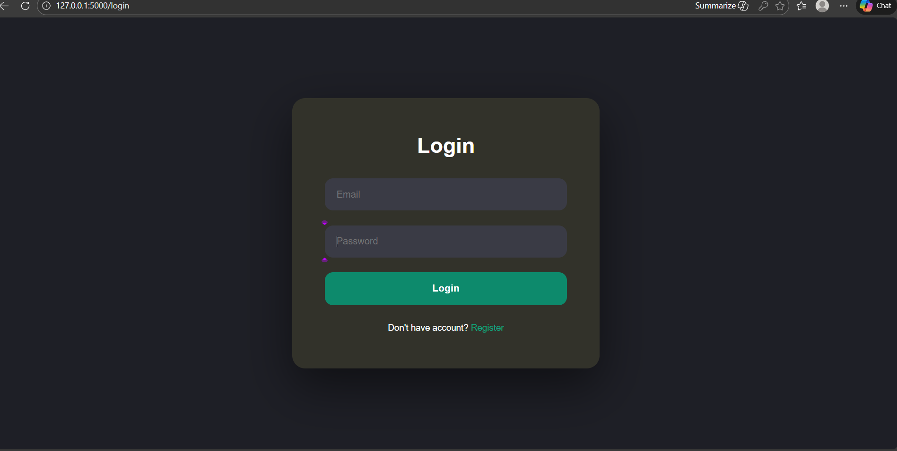

# 🩺 AI-Powered Medical Assistant (Full-Stack Web Application)

A full-stack web application that integrates a modern frontend interface with a backend API and AI-powered Retrieval-Augmented Generation (RAG) pipeline.

This project demonstrates backend development, frontend integration, API handling, authentication flow, and AI service integration.

---


---

# 🏗️ System Architecture

Frontend (HTML/CSS)  
⬇  
Backend (Flask)  
⬇  
Vector Database (PineCone)  
⬇  
LLM (OpenAI / HuggingFace)

---

# 🛠️ Tech Stack

## Frontend
- HTML5
- CSS3
- Jinja Templates
- Responsive UI design

## Backend
- Flask / FastAPI
- REST API routes
- Middleware & error handling
- Session handling (if login implemented)

## AI Layer
- Sentence Transformers (Embeddings)
- FAISS (Vector Store)
- LLM Integration

## Dev Tools
- Git & GitHub
- Virtual Environments
- Environment Variables (.env)

---

# 📂 Project Structure

```
project-root/
│
├── app.py
├── routes/
├── templates/
├── static/
├── screenshots/
├── requirements.txt
└── README.md
```

---

# ✨ Features

- 🔐 Login & session handling
- 💬 Interactive chat interface
- 🔍 Semantic search using vector embeddings
- ⚡ RESTful backend API
- 🧠 AI-generated contextual responses
- 🛡️ Error handling & validation

---

# 📸 Screenshots

## 🔐 Authentication Flow



## 💬 Chat Interface


## 🧠 RAG Pipeline Working


---

# ⚙️ Installation

```bash
git clone https://github.com/your-username/your-repo-name.git
cd your-repo-name
pip install -r requirements.txt
python app.py
```

App runs at:

```
http://127.0.0.1:5000/
```

---

# 🔄 How the Full-Stack Flow Works

1. User submits query from frontend form
2. Request sent to backend API route
3. Backend:
   - Generates embeddings
   - Retrieves relevant documents
   - Sends context to LLM
4. Response returned as JSON
5. Frontend renders formatted answer dynamically

---

# 🧩 Engineering Concepts Demonstrated

- Separation of concerns (UI vs Backend vs AI logic)
- RESTful API design
- Template rendering
- Middleware debugging
- Dependency management
- Clean project structure
- Version control workflow

---

# 📈 Scalability Improvements (Future Work)

- Convert to React frontend
- Dockerize the application
- Deploy using Render / AWS
- Add database (PostgreSQL)
- Add CI/CD pipeline

---

# 👨‍💻 Author

Mohammad Zuheer
